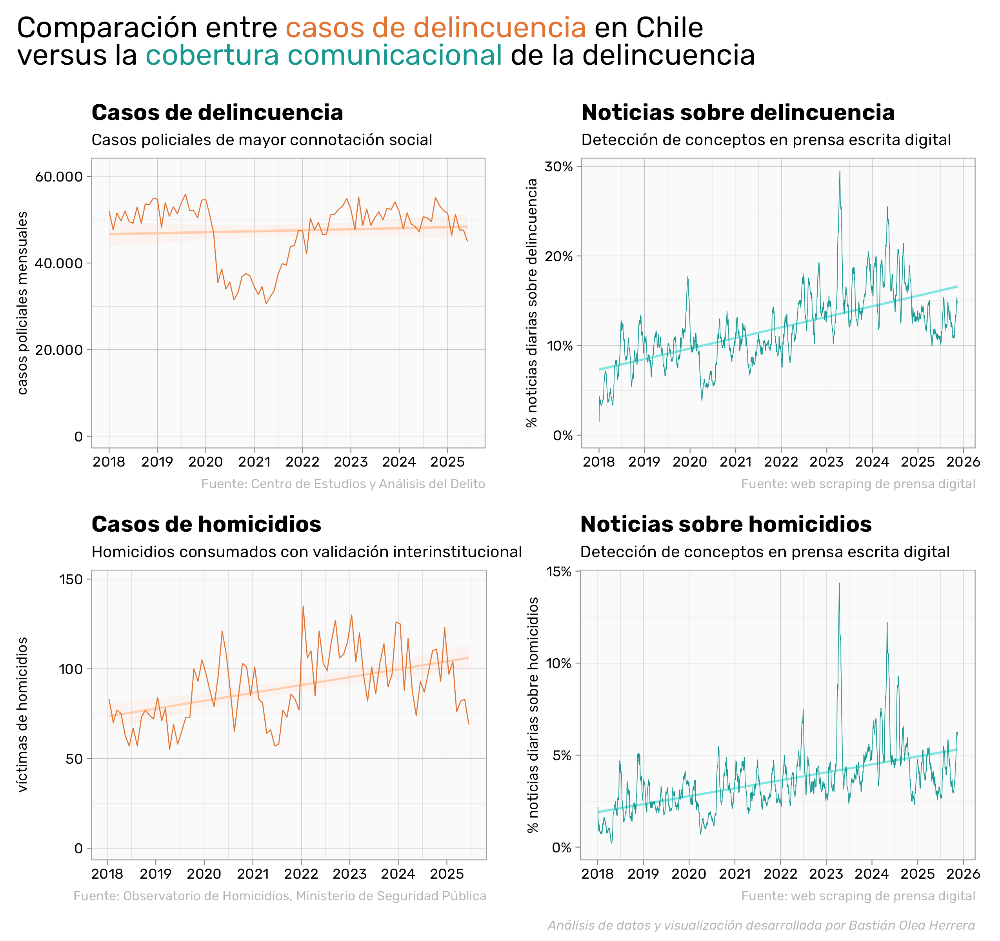

# Cobertura de delincuencia en prensa versus datos de delincuencia y homicidios

Cruce entre distintas fuentes de datos para ver la correlación entre la cobertura mediática de casos de delincuencia en Chile en comparación con las estadísticas mensuales de delitos en el país.

> La hipótesis es que, si bien la delincuencia ha aumentado, **la cobertura de prensa de temas sobre delincuencia ha aumentado en una medida mucho más grande que el fenómeno que pretende reflejar**.

### Notas metodológicas

Sobre la obtención de datos, [ver repositorio de Análisis de prensa chilena](https://github.com/bastianolea/prensa_chile).

Las noticias se detectan en su temática por **coincidencia de conceptos parciales**, donde cada noticia debe superar un umbral de palabras relacionadas al concepto para clasificarse en una temática. Se clasificaron dos temáticas: delincuencia y homicidios.

Por ejemplo, una noticia va a clasificar como en el tema _homicidios_ si contiene conceptos como "asesinato", "homicidio", y si contiene palabras como "falleció" o "murió" pero solamente si son antecedidas o precedidas por el uso de armas. Además, una noticia debe contener al menos 3 instancias de estos conceptos para mantener su clasificación.

Una noticia puede clasificar en ambos temas a la vez si cumple con los umbrales de ambos temas.

En el caso de las noticias, se calculan los procentajes para eliminar el efecto de días con mayor o menor cantidad de noticias. Por la misma razón, también se calcula la media móvil de las cantidades de noticias para suavizar las series.

### Fuentes
Los datos de homicidios son obtenidos desde el [Centro para la Prevención de Homicidios y Delitos Violentos](https://prevenciondehomicidios.cl/#informes).

Los datos de noticias son obtenidos de mi proyecto [Análisis de prensa chilena](https://github.com/bastianolea/prensa_chile/), un proyecto que contiene más de 700 mil noticias únicas de medios de prensa digitales de Chile.

Los datos de delincuencia son obtenidos desde el [Centro de Estudio y Análisis del Delito (CEAD)](https://cead.minsegpublica.gob.cl/estadisticas-delictuales/), por medio de mi proyecto [Visualizador de estadísticas oficiales de delincuencia en Chile](https://github.com/bastianolea/delincuencia_chile/). 

Los delitos de mayor connotación social son: Homicidios, Violencia intrafamiliar, Robos con violencia o intimidación, Robo violento de vehículo motorizado, Robo en lugar habitado, Robos en lugar no habitado, Robo por sorpresa, Robo frustrado, Hurtos, Robo de vehículo motorizado, Otros robos con fuerza en las cosas, Lesiones graves o gravísimas, Lesiones menos graves, Lesiones leves, Homicidios, Femicidios, Violaciones. 

----

Código bajo licencia de código abierto GPL3.

**Bastián Olea Herrera**. Sociólogx y analista de datos. https://bastianolea.rbind.io